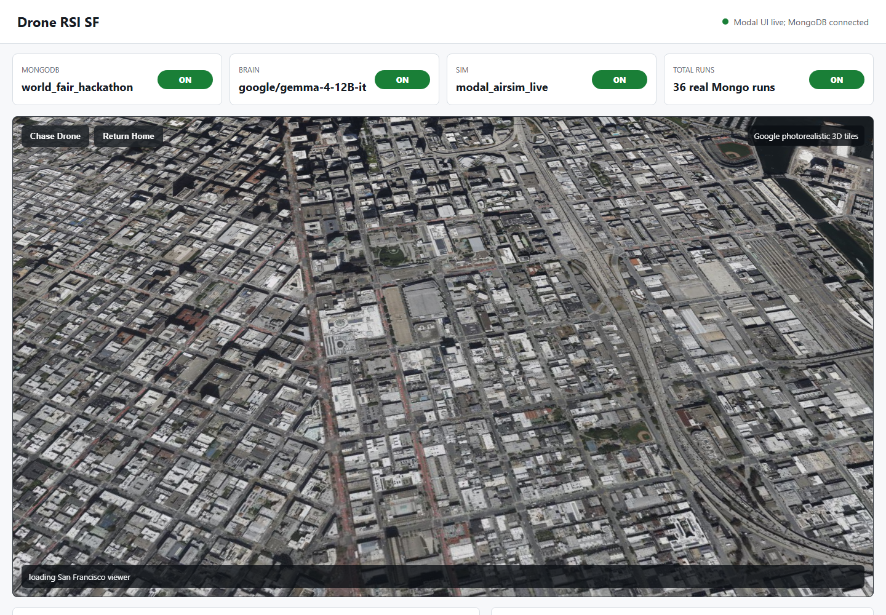

# Autodrone



Autodrone is an LLM-driven drone agent: I made an LLM fly a simulated drone through San Francisco. A user gives a natural-language mission, the system turns that request into a drone flight task, launches the mission in an Unreal/AirSim simulator, and shows the flight through a live 3D dashboard. The demo connects a Gemma-based brain, a Modal-hosted simulator, MongoDB memory, and a Cesium-powered San Francisco view into one agent loop.

The project is also built around recursive self-improvement at the harness level. Every mission attempt creates structured experience: the original request, resolved goal, route, simulator status, step count, safety constraints, guardrail violations, and outcome. That experience is stored in MongoDB. Successful flights become reusable trajectory memory, failed or unsafe attempts become lessons, and run metrics are accumulated so later attempts can be compared against earlier ones. The local RSI harness also records step-level rollouts, generates prompt/completion training examples, tracks GRPO-style reward advantages across grouped attempts, and can adjust the sliding context window when the agent stops making progress.

## What Is Implemented

- Natural-language drone mission flow through the Modal dashboard.
- Unreal/AirSim simulator API for live drone missions.
- Cesium dashboard showing a San Francisco 3D view, model state, mission telemetry, and simulator status.
- MongoDB-backed run memory for mission attempts, trajectories, lessons, and metrics.
- Successful trajectory storage and lookup for repeat missions.
- Failure lesson storage when guardrail violations are observed.
- Rung-3 flight action logging with velocity, yaw, altitude, thrust estimate, motor PWM estimate, and safety constraints.
- Local autonomous RSI harness for step-level rollouts, reward logging, training-example creation, GRPO-style advantage metadata, and context-window adaptation.
- Modal/vLLM and Modular MAX scaffolding for serving Gemma as the drone brain.

## How The Loop Works

```text
user mission
  -> dashboard sends mission request
  -> simulator resolves goal and flies route
  -> flight state, actions, constraints, and outcome are recorded
  -> MongoDB stores run, metrics, trajectory, and lessons
  -> future runs can retrieve prior successful routes and failure lessons
  -> harness can export high-reward rollouts as training data
```

## RSI Scope

The implemented RSI is focused on the agent harness and flight experience. The system improves through memory, trajectory reuse, lessons, metrics, generated training data, and policy-context adaptation. The base Gemma model weights are not automatically changed in the current repo; the implemented training path prepares rollout data and advantage metadata for later fine-tuning or controller updates.

## Tech Stack

- **Gemma**: intended LLM brain for mission reasoning and action generation.
- **Modal**: cloud runtime for the dashboard, model serving, and simulator API.
- **Unreal Engine + AirSim/Colosseum**: drone simulation and physics/control interface.
- **Cesium**: San Francisco 3D visualization in the dashboard.
- **MongoDB**: persistent memory for runs, trajectories, lessons, and metrics.
- **vLLM / Modular MAX**: model-serving scaffolding for Gemma.

## Important Files

- `modal_drone_rsi.py`: Modal dashboard and Mongo-backed mission memory.
- `modal_unreal_sim.py`: Modal AirSim/Unreal simulator API.
- `drone_rsi_harness.py`: local autonomous RSI harness.
- `prompts/drone_rsi_system_prompt.md`: JSON action policy prompt for the drone agent.
- `README_RSI_HARNESS.md`: detailed harness notes and commands.
- `unreal/DroneRSI/`: Unreal project, AirSim plugin source, Cesium plugin source, and project assets.

## Current Status

This is a working hackathon prototype. The live demo story is: an LLM-driven mission system flies a drone in simulation, records its experience, remembers successful routes, stores failure lessons, and produces rollout data for future self-improvement. Generated build artifacts, local secrets, logs, downloaded archives, and packaged simulator binaries are intentionally excluded from the repository.
